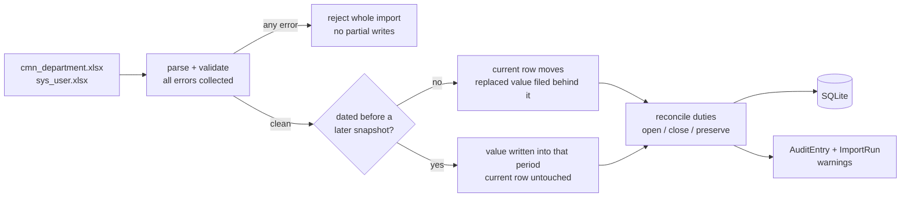
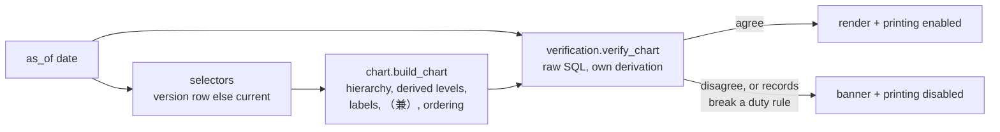
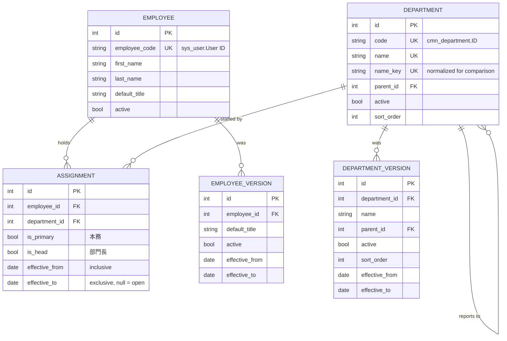

# 組織図自動出力アプリ — 設計・実装報告書

## 1. Requirements

| # | Requirement | Answer |
|---|---|---|
| 1 | *(required)* Printable chart like the hand-made 組織図 | Chart page at `/`, A3 landscape stylesheet, generated from both masters by one command |
| 2 | *(required)* Maintainable by someone other than the author; setup instructions | Standard Django project, two runtime dependencies, SQLite. `README.md`; verified from a clean clone on Python 3.12 and 3.14 |
| 3 | *(option)* Maintain both masters with change history | Django admin behind a login; every change effective-dated and audited, from the screens and the import alike |
| 4 | *(option)* Propose a 兼務 structure | [§4](#4-兼務-concurrent-duties) describes the implemented model; [§4.6](#46-what-the-import-masters-cannot-state) covers the input-format limit and a proposed additional sheet |

---

## 2. System design

### 2.1 The problem

`sys_user.Department` records one current department per person, so a second post cannot be
stated. Neither master records *when* anything was true, so no chart can be reprinted for a past
date, no reorganization can be prepared ahead of time, and no change can be explained afterwards.
Effective-dated assignments answer both.

### 2.2 Effective dating

Assignments and master values are effective-dated.

**Duties** — one row per duty in `assignments` with a half-open `[effective_from, effective_to)`
interval. 本務 and 兼務 are the same record, distinguished by `is_primary`.

**Masters** — `DepartmentVersion`/`EmployeeVersion` hold superseded values with the interval each
applied to; `Department`/`Employee` hold the value outside every recorded interval. A read for a
date takes the version row covering it, else the base row. A future-dated edit therefore puts the
future value in the base row immediately, and today's read still finds today's value in a version
row.

Versions include parent and active status, not only labels, so a historical chart keeps the people
and the hierarchy of its own date: a July leaver still appears on April's sheet, and re-parenting a
unit does not redraw sheets already printed.

The as-of date is an input to the query, not a property of the data.

### 2.3 Backdated corrections

A correction dated into a period a later record already covers is written *into that period*; the
value in force now is left alone. A snapshot dated July is the more authoritative statement about
July onward. The admin and the import command decide this through the same function, so they cannot
disagree.

### 2.4 Derived grouping levels

The masters encode nesting as space-separated paths such as `ソリューション営業部 1課`, with no row
for the intermediate level. Where siblings share a leading component the chart draws that level and shortens the
children. It is not drawn when a sibling already carries the name, or an ancestor already printed
it. Prefix matching is folded, so full-width and half-width spellings name one level, not two; the
surviving characters are the master's own.

---

## 3. Architecture

### 3.1 Modules

| Module | Responsibility |
|---|---|
| `models.py` | schema: departments, employees, assignments, two version tables, import runs, audit |
| `domain.py` | value rules: name normalization, title ranking, fiscal year, English glosses |
| `services.py` | versioning, validation, audit. The admin routes everything through it; the importer routes versioning, audit and assignment changes through it and saves plain field updates itself |
| `selectors.py` | as-of reads for the chart |
| `chart.py` | `build_chart(as_of)` — the one path that produces a chart |
| `verification.py` | `verify_chart` — re-derives the chart with raw SQL and reports disagreement |
| `importer.py` | validation and transactional import of both workbooks |
| `admin.py`, `forms.py` | maintenance screens; rules are invoked through `services`, with only the cross-row formset checks restated because unsaved rows cannot be queried |
| `views.py`, templates, CSS | the chart page, the A3 print rules, and the print gate that acts on the verifier's report |

### 3.2 Import flow



### 3.3 Render flow



The two derivations share `domain.py` and nothing else. See [§5](#5-correctness).

---

## 4. 兼務 (Concurrent duties)

> Requirement 4: *"…design and propose a way to realize what kind of structure should be used to
> manage it (implementation is not required)."*

### 4.1 Options considered

| | A. Extra columns (`Department2`, `Department3`…) | B. Side table for 兼務 only | **C. One row per duty** |
|---|---|---|---|
| Number of duties | Fixed by column count | Unlimited | Unlimited |
| Effective dating | One date set per column, or none | Possible | Native |
| Source of truth | Split across N columns | Two stores kept consistent by every writer | One table |
| Adding a third duty | Schema change | No change | No change |
| "Who is in this department" | `WHERE d1=? OR d2=? OR d3=?` | Union of two queries | One predicate |

**C is proposed and implemented.** A and B encode the *number* of duties, or *where* a duty lives,
into the schema; C encodes only that a duty exists. `sys_users.Department` keeps its meaning as the
input for the 本務, so the change is additive.

### 4.2 Schema

| Column | Type | Null | Meaning |
|---|---|---|---|
| `employee_id` | FK | no | who |
| `department_id` | FK | no | where |
| `is_primary` | bool | no | **本務.** At most one open row per person |
| `is_head` | bool | no | **部門長.** At most one open row per department |
| `title_override` | text | yes | title held in this duty; NULL uses the person's own |
| `effective_from` | date | no | inclusive |
| `effective_to` | date | yes | **exclusive**; NULL is open-ended |
| `note` | text | no | free reason, e.g. 発令番号 |
| `source` | text | no | `master` or `manual` |

Half-open intervals mean a duty ending the day another begins leaves no gap and no overlap.

### 4.3 Where each rule is enforced

| Rule | Enforced by |
|---|---|
| Interval is non-empty | **Database** — `CHECK` |
| One open duty per (person, department) | **Database** — partial unique index |
| At most one open 本務 per person | **Database** — partial unique index |
| At most one open 部門長 per department | **Database** — partial unique index |
| Overlapping duplicate duty, two 本務, or two 部門長 where either interval is bounded | **Application** — `services.reject_assignment_conflicts`, called by both write paths |
| Every drawn department reachable from a root | **Application** — `services.reject_chart_detachment`, verifier blocks print as a second check |
| Every active employee has one 本務 | **Neither, deliberately** |

Partial indexes constrain open-ended rows only, so they express *at most one*, never *exactly one*.
An employee with a blank `Department` gets zero primary rows; the importer reports that rather than
inventing one. Two unrelated bounded duties may overlap freely — what is refused is a duplicate
(person, department) duty, a second 本務, or a second 部門長 where either interval is bounded. Both
write paths call the same check.

### 4.4 Entity relationships



### 4.5 Worked example

Illustrative names. 佐藤 (`U001`) is 本部長 of 営業本部 and also heads 管理部 from 1 October.

```
id  employee  department  is_primary  is_head  effective_from  effective_to
 1  U001      営業本部     true        true     2026-04-01      NULL
 2  U001      管理部       false       true     2026-10-01      NULL
```

As of **2026-09-30**, row 2 has not started:

```
営業本部
  佐藤  本部長
```

As of **2026-10-01**, both are live and the non-primary one is marked:

```
営業本部
  佐藤  本部長
管理部
  （兼）佐藤  本部長
```

Nothing was edited between the two sheets.

### 4.6 What the import masters cannot state

A property of the input format, not of the storage model. The two import masters cannot *state* a
non-head concurrent duty:

- `sys_user.Department` is one column → one 本務 per person.
- `cmn_department.Department head` is one column → a 兼務 can be *derived* only for a head.
- Duplicate `User ID` rows are rejected.

The importer can still create a non-head concurrent duty while reconciling against duties already
stored — for instance when a headship moves between departments — and the admin can record one
directly. What cannot happen is a workbook declaring one.

This is visible in the supplied data. The reference sheet
`組織図(Current Organizational Chart).xlsx` carries five `（兼）` marks; importing the two masters
produces four, all heads. The missing one is 山田 at 購買調達部, whose master department is
ソリューション営業部 2課 — a membership the masters have no column to express.

**Proposed fix** — one additional sheet, existing masters untouched:

| Column | Meaning |
|---|---|
| `User ID` | matches `sys_user.User ID` |
| `Department` | the concurrent department |
| `Start date` | `YYYY-MM-DD` |
| `End date` | blank for open-ended |

Rows would map to `assignments` with `is_primary = false` under the same overlap rules; no schema
change is needed. Not implemented — the input format would have to be agreed with Syslabo first.

---

## 5. Correctness

**Database constraints** carry the rules that must never break — the three partial unique indexes
and the interval check. They hold regardless of which code writes.

The ORM renderer and the raw-SQL verifier derive each chart independently, and the view disables
printing when they disagree. The rule hiding an unverified sheet is inline in the page as well as in
the stylesheet, so it survives static files not being served.

The verifier also checks the records against the duty rules directly, since two derivations of a
broken database agree with each other.

Both derivations share normalization and title ranking in `domain.py`, so an error there is a
correlated blind spot.

**147 tests** across the value rules, the write layer, the chart contract, the admin screens, the
supplied workbooks, and the organization shapes that pull the two derivations apart.

---

## 6. Tech stack

| Choice | Reason |
|---|---|
| **Django 6.0** | A widely known framework is easier to inherit than a bespoke application, and its admin, auth, ORM and migrations are the parts this task needs |
| **SQLite** | Free as the brief requires; one file, no server to administer |
| **Django admin** | Supplies the maintenance UI for requirement 3; forms and services enforce the domain rules |
| **openpyxl** | Reads the supplied `.xlsx` directly, no Excel installation |
| **Python 3.12–3.14** | 3.12 is Django 6.0's floor; the upper bound is closed because nothing here has been tried on 3.15 |

Two runtime dependencies, both pinned exactly; the two requirements files pin the transitive set as
well. Runs offline, binds to localhost, no API key.

Nothing from `sys_user.xlsx` beyond the six chart columns is stored. The `Password` value arrives
as part of each worksheet row and is discarded immediately: it is not kept in the parsed record and
never reaches the database. The masters are committed in `task-materials/` so a clone reproduces the
pipeline, which is why the repository is private.

---

## 7. Scope

Intentional boundaries.

- **A non-head 兼務 cannot be stated in the import masters** — [§4.6](#46-what-the-import-masters-cannot-state).
  The admin records one directly.
- **Authentication is implemented; fine-grained roles are out of scope.**
- **Localhost only.** Serving it over a network means the Django deployment checklist first.
- **Departments have no founding date** in the masters, so a chart for a date before the first
  import draws the units with nobody in them.
- **Renderer and verifier share `domain.py`**, so an error there affects both — [§5](#5-correctness).
- **The bounded-interval overlap rules are application-enforced**, since a partial index cannot
  express them. A database edited outside the application can hold a violation; the verifier detects
  it and printing is disabled.
